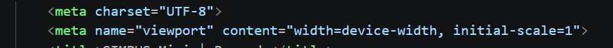

# Jobsheet 3 
## Nama : M. Naufal Aryandito A.
## Kelas : TI 2D

Menambahkan konfigurasi viewport pada bagian `<head>` di seluruh halaman HTML seperti `index.html`, halaman Buku, dan halaman Anggota.

Tujuannya agar tampilan website mengikuti ukuran layar perangkat, terutama saat dibuka melalui HP.

## Penyesuaian Navbar Responsif

Pada layar di bawah `768px`, navbar dibuat bertumpuk ke bawah supaya menu tetap terlihat rapi dan tidak memenuhi layar.

